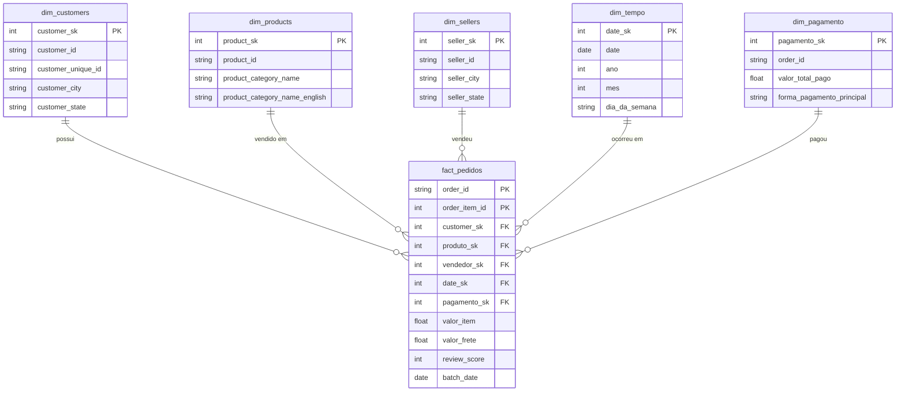

@"

```mermaid
erDiagram
  fact_pedidos {
    string order_id PK
    int order_item_id PK
    int customer_sk FK
    int produto_sk FK
    int vendedor_sk FK
    int date_sk FK
    int pagamento_sk FK
    float valor_item
    float valor_frete
    int review_score
    date batch_date
  }
  dim_customers {
    int customer_sk PK
    string customer_id
    string customer_unique_id
    string customer_city
    string customer_state
  }
  dim_products {
    int product_sk PK
    string product_id
    string product_category_name
    string product_category_name_english
  }
  dim_sellers {
    int seller_sk PK
    string seller_id
    string seller_city
    string seller_state
  }
  dim_tempo {
    int date_sk PK
    date date
    int ano
    int mes
    string dia_da_semana
  }
  dim_pagamento {
    int pagamento_sk PK
    string order_id
    float valor_total_pago
    string forma_pagamento_principal
  }
  dim_customers ||--o{ fact_pedidos : "possui"
  dim_products  ||--o{ fact_pedidos : "vendido em"
  dim_sellers   ||--o{ fact_pedidos : "vendeu"
  dim_tempo     ||--o{ fact_pedidos : "ocorreu em"
  dim_pagamento ||--o{ fact_pedidos : "pagou"
```
"@ | Set-Content -Path docs\architecture\er-diagram.md