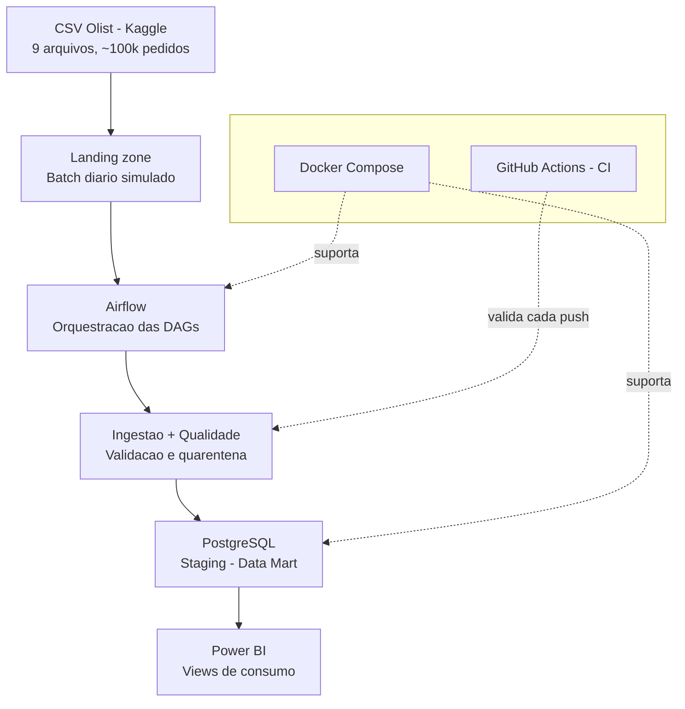

@"

```mermaid
flowchart TD
    A[CSV Olist - Kaggle<br/>9 arquivos, ~100k pedidos] --> B[Landing zone<br/>Batch diario simulado]
    B --> C[Airflow<br/>Orquestracao das DAGs]
    C --> D[Ingestao + Qualidade<br/>Validacao e quarentena]
    D --> E[PostgreSQL<br/>Staging - Data Mart]
    E --> F[Power BI<br/>Views de consumo]

    subgraph Infra[" "]
        G[Docker Compose]
        H[GitHub Actions - CI]
    end

    G -.suporta.-> C
    G -.suporta.-> E
    H -.valida cada push.-> D
```
"@ | Set-Content -Path docs\architecture\pipeline-architecture.md